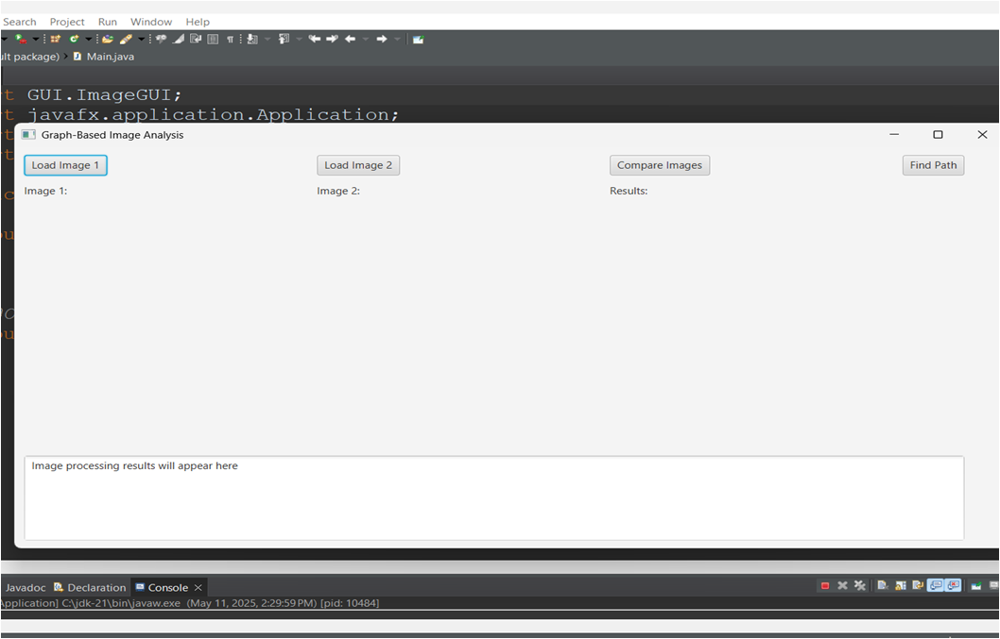

Image Similarity and Pathfinding System

## Overview
The Image Similarity and Pathfinding System is a Java and JavaFX based application designed to help compare the level of similarity from different pictures and find the shortest path form two selected points from the image.
This system focuses on core Java concepts, clean UI design, graph-based structure like, Region Adjacency Graphs (RAGs), Graph Neural Networks (GNNs),  k-Nearest Neighbor Graphs (k-NN), Dijkstra’s algorithm.

I developed this project as part of the academic requirement and the initiative to strengthn my skills in Java, OOP, Data Structure and Algorithms and JavaFX.

## Features

# Image similarity
-> Choose two images you want to compare
-> Check the similarity percentage

# Path finder
-> Choose the image you want to find the path on
-> find the path

## Technologies Used
-> Programming Language: Java
-> GUI: JavaFX
-> Tools: Eclipse, Git, Github

# Programming concepts used
-> Object Oriented Programming
-> Data Structures And algorithm
->  Region Adjacency Graphs (RAGs)
-> Graph Neural Networks (GNNs)
->  k-Nearest Neighbor Graphs (k-NN)
-> Dijkstra’s algorithm

## How to run the project

# Prerequisites
-> Java JDK 17 or later
-> JavaFX SDK
-> Java IDE (eclipse recommended)

# Steps to follow|
1. Close the repository
2. Open the project on the IDE
3. Configure JavaFX VM options: --module-path "/path/to/javafx/lib" --add-modules javafx.base,javafx.controls,javafx.fxml,javafx.graphics,javafx.media
4. Run application

## Application Screenshots

### Home Screen

